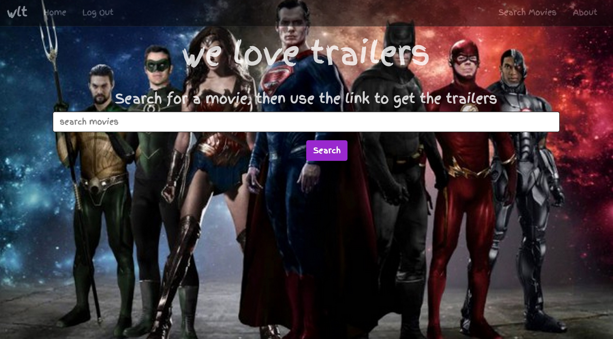

#weLoveTrailers

##WDI_LDN_14 FINAL PROJECT

###Why?

These days the wait for the movie trailers are just as highly anticipated as the wait for the actual movie, over 88 million people watched the official trailer for Star Wars - The Force Awakens within 24 hours. 

I like watching movies and found that when looking at a trailer, at the end would be presented with films I had not come across before as similar suggestions, I therefore had the idea what if you could watch a video of a trailer and have the opportunity to set yourself a reminder to check it out at the cinema, or by the book, or rent online.

The reminder feature hasn't been implemented in this project as yet, but that will be the next stage I hope to achieve.

Image of Homepage: 

##Technologies Used

I experimented with a number of API's for this project, mainly because there are varying levels of data that they offer.

Initially i planned to use [OMDBapi](http://www.omdbapi.com/) for the posters.  OMDB, does not require a key, and for single title searchs offer quite a lot of data, on multiple search queries however they only offer title, and year of release, also I found they didn't have a lot of the current or films not yet released.

I was then going to use [Trailer Addict](http://www.traileraddict.com/trailerapi), for the poster information, their API also does not require a key. They send their data in XML, which isn't to hard to convert to JSON, however they also did not offer a lot of data.

For the video trailers I decided to use Youtube, it is easy to setup an app and get a developer key, and i cannot think of any other free resource with such a comprehensive amount of data.[Youtube Developers](https://developers.google.com/youtube/v3/)

Finally at the last minute!, I decided to do a quick search and came across [themoviedb.org API](https://www.themoviedb.org/documentation/api), to use their data you need to register to get an API key. They do seem to offer quite a bit of data, and also they offer details of the latest and future films, which was just what I needed. 

NodeJs was used on the backend, with Mongoose and MongoDB for modelling and database.

On the frontend AngularJs was used along with Bootstrap for styling, and some animate.css.

##What I learned

###APIs are cool!

Though the information you get from them can vary, but its great building products using some of the data sources available.

I look forward to using APIs going forward and continuing to build my own.

AngularJs seems interesting, though it will take me a little longer to get used to, i look forward to getting more practise using it with my own projects in the future.

Note: Copyright of the Homepage image belongs to the owners.

&copy; - Andrea Mckenzie - September 2015